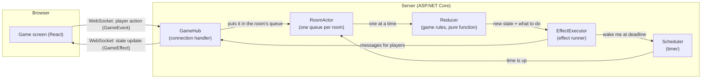

# Music Memory Duel

Music Memory Duel is a 2–5 player online game: each round, one player (the **composer**) plays a short melody on an 8-key piano, and everyone else (the **solvers**) has to reproduce it (pitch and rhythm) before time runs out. The composer role rotates every round.

**Try it: [music-memory-duel.onrender.com](https://music-memory-duel.onrender.com)**
It runs on a free instance that sleeps after ~15 minutes of inactivity, so the first load can take up to a minute to wake up.

## Architecture

Players connect over a **WebSocket** (SignalR), so the server can push updates at any moment instead of waiting to be asked. The server is authoritative: it owns the timers, checks every move, and computes every score.



**How it works:**

- **Game rules are one pure function (Reducer).** It takes the current state, what happened, and the current time. It returns the new state and a list of effects. It never sends a message, reads a clock, or touches a database.
- **Effects are data, not actions.** The function does not broadcast anything; it returns *"send this message"* or *"wake me in 15 seconds"*. A separate runner performs them.
- **xUnit tests.** Because of the two points above, all 11 scoring branches are tested by calling a function, instead of starting a server and waiting out real timers.
- **One queue per room, no locks.** Every action in a room (a move, a timeout, a disconnect) enters the same queue and is handled one at a time. Two players acting in the same millisecond cannot corrupt the state, so there is no `lock` anywhere in the project.
- **The hub holds no game rules.** It only translates an incoming WebSocket call into an event and puts it in the room's queue.
- **Timers are deadlines, not ticks.** The server sends one timestamp per phase ("solving ends at 12:00:15") and the client draws its own countdown. The client's countdown is display only — the server closes the phase at its own deadline no matter what the client shows.
- **Clock sync.** A browser's clock is never exactly the server's, so on joining a room the client pings the server 5 times, takes the median difference, and corrects every countdown by it.

## Running locally

**With Docker** — one command, nothing else to install. The image builds the frontend and the backend and ships them as a single service:

```bash
docker build -t mmd .
docker run --rm -p 8080:8080 mmd
```

Then open `http://localhost:8080`.

**For development**, run the two parts separately. Backend (`server/`) on `http://localhost:5149`:

```bash
cd server
dotnet run
```

Frontend (`web/`) on `http://localhost:5173`. Vite forwards `/hubs` to the backend, so the client's hub URL stays relative and the same code works in both setups:

```bash
cd web
npm install
npm run dev
```

Either way, open the app in two browser tabs (or on two devices) to play a match against yourself.

## Game rules & scoring

Each round: the composer plays a melody (up to 15s), everyone (including the composer) then has to reproduce it within a solve window. A sequence matches when both **pitch** and **rhythm** line up: pitch exactly, rhythm within a tolerance. Intervals are scaled to the melody's total length, so playing the same melody a bit faster or slower still counts as correct.

**Standard scoring (3+ players)**:

| Role | Situation | Points |
|---|---|---|
| Composer | confirmed + **some but not all** solvers correct | **+3** |
| Composer | confirmed + **all** solvers correct (too easy) | **0** |
| Composer | confirmed + **no one** correct (unsolvable) | **0** |
| Composer | **didn't confirm** | **−1** |
| Solver | correct **and the only one** correct | **+3** |
| Solver | correct | **+2** |
| Solver | wrong / timed out | **0** |

**Duel scoring (exactly 2 players)**:

| Opponent | Composer confirmed | Composer | Opponent |
| -------- | ------------------ | -------- | -------- |
| correct  | no                 | **−1**   | **+3**   |
| correct  | yes                | **0**    | **+1**   |
| wrong    | yes                | **+1**   | **0**    |
| wrong    | no                 | **−1**   | **0**    |

## Security / Anti-cheat

The server is authoritative: it owns every deadline, verifies every submission, and computes every score - a client cannot extend its own time, submit after a deadline, or affect anyone else's result.

- **Timing plausibility check.** A submission is compared against how a human could physically play: consecutive notes can't be closer together than 50ms, and for sequences of 3+ notes, the average timing deviation from the target melody can't be near-zero. A near-zero deviation means the exact same timestamps came back, which a human replaying by ear cannot produce; a machine copying an intercepted message can.
- **Submission validation.** Note count is bounded (1–100), and timestamps must be non-decreasing.
- **Idempotent submissions.** Exactly one submission is accepted per `(roundId, playerId)`; anything else (a network retry, a stale message from a previous round arriving late) is ignored.
- **Rate limiting.** Each connection is capped at a generous number of Hub calls per 10-second window.
- **Reconnect tokens.** Each player holds a private token (never broadcast to other players) that must match before a reconnect is allowed to resume that player's identity - knowing someone's public player ID alone isn't enough to "become" them.

## Known limitations

**Replay attacks can't be fully prevented.** The server has to send the composer's notes to every client so they can be played back. This means the correct answer exists in every client's memory at some point. A modified client can intercept that message over the WebSocket and echo the exact same notes back as its own answer, every time.

The timing plausibility check above raises the bar (a naive replay is caught instantly), but an attacker who adds realistic-looking jitter to the replayed timestamps can still get through. 

One possible solution would be for the server to render and stream the audio itself, so the notes never reach the client as data. But even then, an attacker could record the live audio and transcribe it back into notes (e.g. via pitch detection), and still submit those notes to cheat — so this wouldn't fully close the gap

**The small grace window at a deadline is intentional.** The phase closes when the timeout event (Scheduler class) reaches the front of the room's queue, so an answer arriving a few milliseconds late still counts. 
A stricter check would reject players for their own network latency, not for being late.